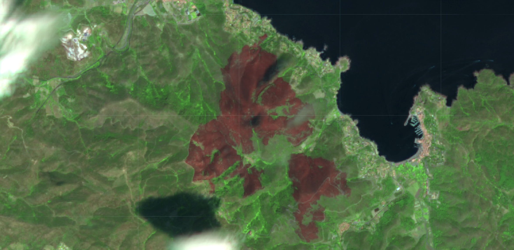

<section id="projects">
  <h2>My Projects</h2>
  

    <!-- Project 1 -->
    

      
      <h3>Optimal Control of a Levitated Quantum Particle</h3>
      
Designed static potentials to enhance quantum behavior in a levitated particle. Simulated the particle’s time evolution and analyzed its Wigner function using Python workflows for modeling, propagation, and constrained optimization.

      <a href="https://github.com/username/quantum_particle" class="project-link">View Repository</a>
    

    <!-- Project 2 -->
    

      
      <h3>Inverse Design of Pulses in Magnonic Waveguides</h3>
      
Developed pulses for magnonic waveguides using GPU-accelerated simulations. Combined numerical modeling with optimization techniques to shape pulses for controlling magnon dynamics.

      <a href="https://github.com/username/magnonic_pulses" class="project-link">View Repository</a>
    

    <!-- Project 3 -->
    

      
      <h3>Pulse Design for Qubit Control in Waveguides</h3>
      
Designed electromagnetic pulses to manipulate qubits in a waveguide using analytical modeling and GPU-accelerated simulations. Collaborated with experimentalists, and the predicted pulses were successfully implemented in the laboratory.

      <a href="https://github.com/username/qubit_pulses" class="project-link">View Repository</a>
    

    <!-- Project 4 -->
    

      
      <h3>Wildfire Impact and Vegetation Regeneration</h3>
      
Used satellite imagery to detect a wildfire and analyze vegetation dynamics before, immediately after, and two years later. Produced NDVI maps showing vegetation loss and recovery using Python workflows for data processing and time-series analysis.

      <a href="https://github.com/username/wildfire_analysis" class="project-link">View Repository</a>
    

  

</section>

